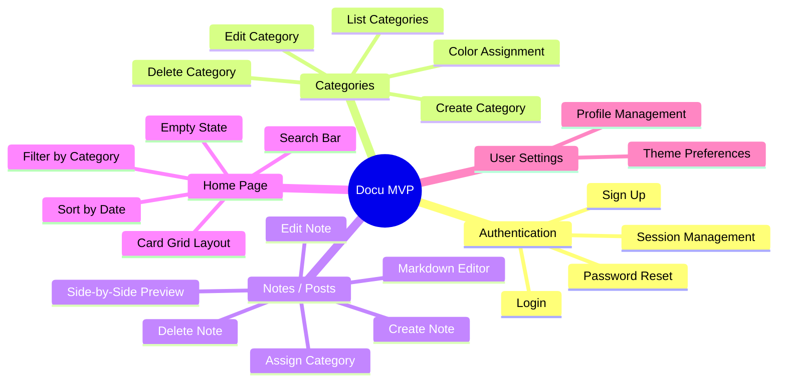
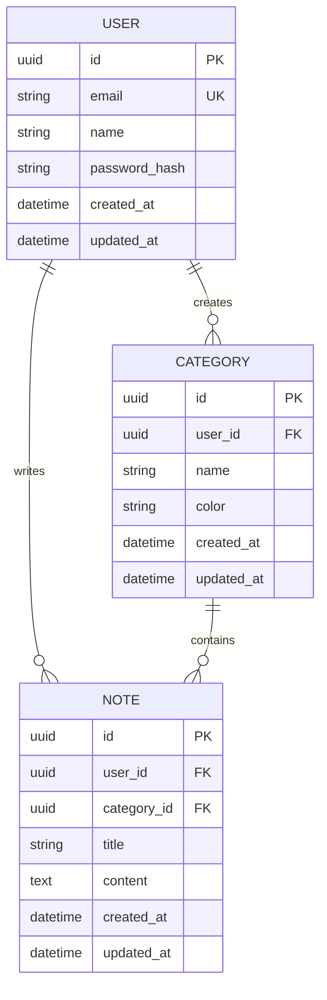
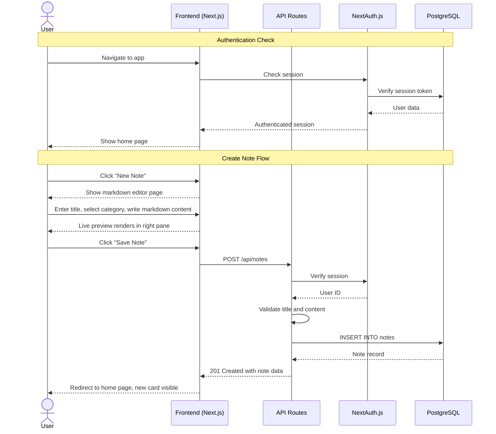
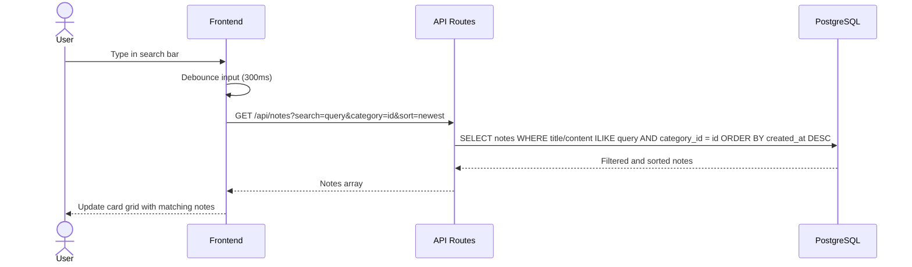
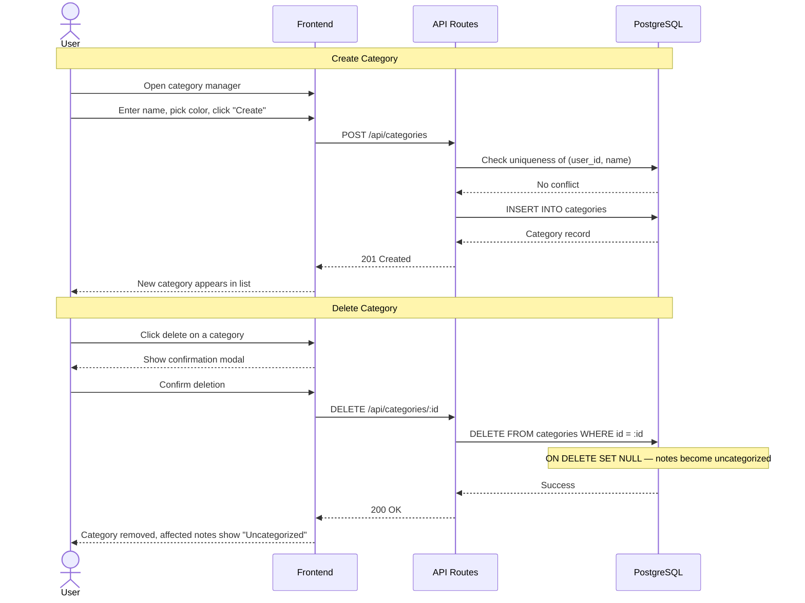
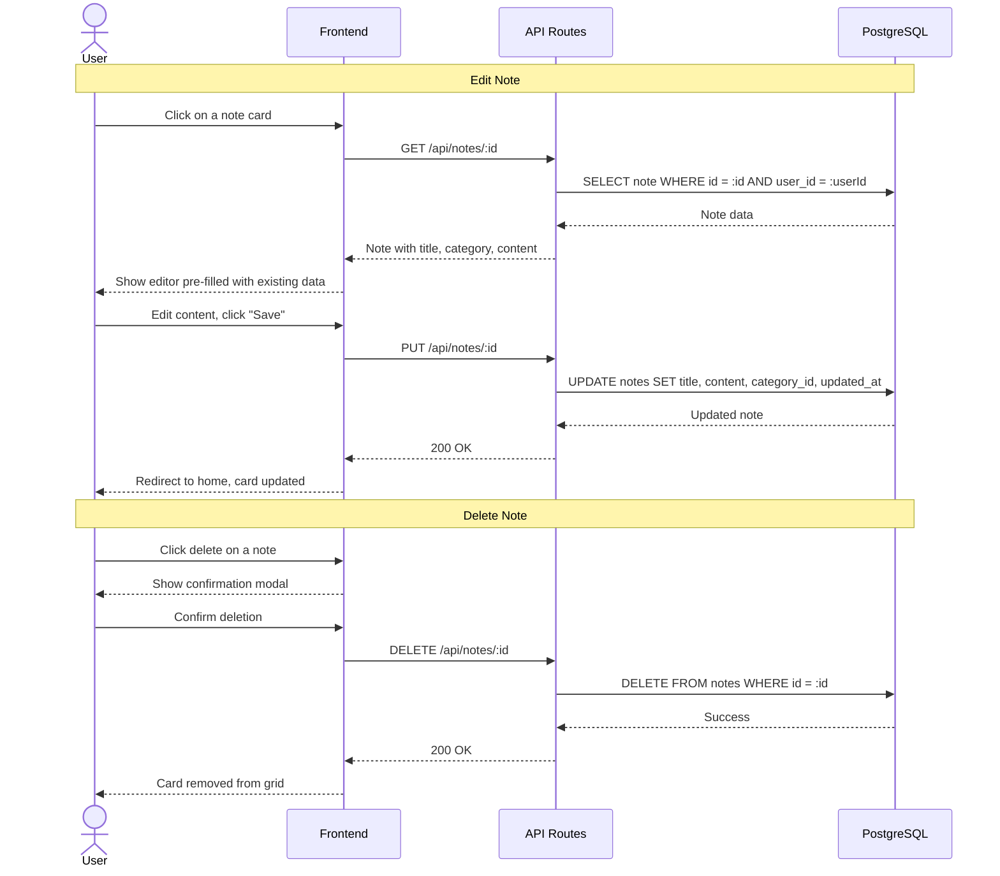
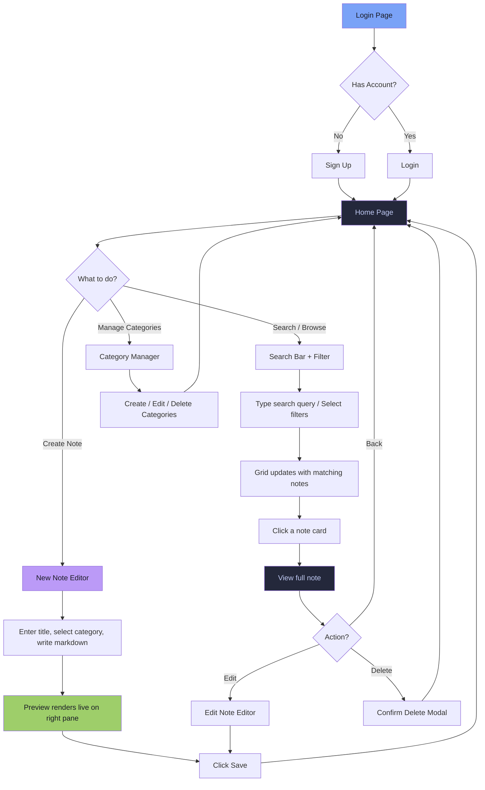

# 📝 Docu — Product Requirements Document (PRD)

**Version:** 1.0 (MVP)  
**Author:** Willy Liu  
**Date:** July 18, 2026  
**Status:** Draft  

---

## Table of Contents

1. [Product Overview](#1-product-overview)
2. [Tech Stack](#2-tech-stack)
3. [Features & Requirements](#3-features--requirements)
4. [Data Model](#4-data-model)
5. [Database Sequence Diagram](#5-database-sequence-diagram)
6. [UX & Design Guidelines](#6-ux--design-guidelines)
7. [Core User Flow](#7-core-user-flow)
8. [Edge Cases & Error Handling](#8-edge-cases--error-handling)
9. [Success Metrics](#9-success-metrics)
10. [Open Questions & Future Considerations](#10-open-questions--future-considerations)

---

## 1. Product Overview

### 1.1 Vision Statement

> **Docu** is a personal knowledge base and note-taking web app for software engineers who are tired of re-asking AI the same syntax questions. Write it down once — find it instantly forever.

### 1.2 Problem Statement

Software engineers constantly context-switch between languages, frameworks, and tools. This leads to a recurring cycle:

| Pain Point | What the engineer thinks |
|---|---|
| **Syntax Amnesia** | *"How do I write a list comprehension in Python again?"* |
| **Repeat Lookup Fatigue** | *"I've asked AI this exact same question before — three times now."* |
| **Scattered Notes** | *"I know I wrote this down somewhere… was it Notion? A Gist? Slack?"* |
| **Meeting Recall** | *"What did we decide in that sprint planning 2 weeks ago?"* |
| **Lost Context** | *"I solved this bug before but can't remember how."* |

Existing tools are either too heavy (Notion, Confluence), too unstructured (plain text files), or not optimized for code-centric note retrieval. Engineers need something lightweight, fast, and laser-focused on quick lookup of their own notes.

### 1.3 Solution

Docu solves this by:

1. **Capturing** notes with a clean markdown editor that supports code blocks, with real-time side-by-side preview.
2. **Organizing** notes with user-defined categories (e.g., "Python", "React", "Meeting Notes", "DevOps").
3. **Retrieving** notes instantly through full-text search across titles, categories, and content, with flexible sorting and filtering.
4. **Presenting** all notes in a scannable card-based grid layout on the home page for at-a-glance browsing.

### 1.4 Target Users

| Persona | Description |
|---|---|
| **The Forgetful Engineer** | Keeps looking up the same syntax, CLI commands, or API patterns and wants a personal quick-reference library |
| **The Organized Dev** | Wants a clean, categorized knowledge base for code snippets, architecture notes, and troubleshooting guides |
| **The Meeting Note-Taker** | Needs a simple place to jot down meeting decisions, action items, and discussion notes for future reference |
| **The Lifelong Learner** | Constantly learning new tools/languages and wants to document "aha" moments for later recall |

### 1.5 Scope — MVP V1

**In Scope:**
- User authentication (sign-up / login with email + password)
- Category management (CRUD operations)
- Note/post management (CRUD operations)
- Markdown editor with side-by-side live preview
- Home page with card-based grid layout of all notes
- Search bar (search by title, category, or content)
- Filter & sort (newest, oldest, by category)
- Responsive web application
- Tokyo Night color theme

**Out of Scope (V1):**
- OAuth sign-in (Google, GitHub)
- Real-time collaboration / sharing
- AI-assisted note generation
- Export to PDF / external formats
- Tagging system (beyond categories)
- Mobile native apps
- Offline mode / PWA
- File or image uploads within notes
- Version history for notes

---

## 2. Tech Stack

### 2.1 Architecture Overview

Docu follows a **monolithic-first** architecture using Next.js for both frontend and backend, optimized for speed of development and simplicity during the MVP phase.

```
┌──────────────────────────────────────────────────┐
│                    CLIENT                         │
│          Next.js (React + TypeScript)             │
│          Styled with Vanilla CSS                  │
│          Tokyo Night Theme                        │
└──────────────┬───────────────────────────────────┘
               │ HTTPS
┌──────────────▼───────────────────────────────────┐
│               SERVER (Next.js API Routes)         │
│  ┌─────────────┐  ┌──────────────────────────┐   │
│  │    Auth      │  │    Notes & Categories    │   │
│  │  (NextAuth   │  │    CRUD Operations       │   │
│  │    .js)      │  │                          │   │
│  └─────────────┘  └──────────────────────────┘   │
└──────────────┬───────────────────────────────────┘
               │
         ┌─────▼──────┐
         │ PostgreSQL  │
         │ (Prisma ORM)│
         │  Supabase   │
         └────────────┘
```

### 2.2 Technology Choices

| Layer | Technology | Rationale |
|---|---|---|
| **Framework** | Next.js 15 (App Router) | Full-stack React framework; SSR + API routes in one codebase |
| **Language** | TypeScript | Type safety, better DX, fewer runtime errors |
| **Styling** | Vanilla CSS (custom properties) | Maximum control over Tokyo Night theming; no dependency bloat |
| **Database** | PostgreSQL (via Supabase) | Relational data model, full-text search support, scalable |
| **ORM** | Prisma | Type-safe database queries, auto-generated types, easy migrations |
| **Authentication** | NextAuth.js (Auth.js v5) | Flexible auth with credentials provider; OAuth-ready for future |
| **Markdown Parsing** | `react-markdown` + `remark-gfm` | Render GitHub-flavored markdown with code syntax highlighting |
| **Code Highlighting** | `rehype-highlight` or `react-syntax-highlighter` | Syntax highlighting in markdown preview with Tokyo Night code theme |
| **Deployment** | Vercel | Optimized for Next.js, automatic previews, edge network |
| **Monitoring** | Vercel Analytics | Performance monitoring and usage insights |

### 2.3 Markdown Editor Strategy

The markdown editor follows a **split-pane** approach:

| Pane | Description |
|---|---|
| **Left — Editor** | Plain `<textarea>` with monospace font (JetBrains Mono). Supports tab indentation and standard keyboard shortcuts. |
| **Right — Preview** | Live-rendered markdown using `react-markdown`. Updates in real-time as the user types. Supports GFM (tables, checkboxes, strikethrough), code blocks with syntax highlighting, and inline code. |

> **Note:** The split-pane view can be toggled to editor-only or preview-only mode on smaller screens.

---

## 3. Features & Requirements

### 3.1 Feature Map



### 3.2 Feature Details

#### F1: User Authentication

| ID | Requirement | Priority | Acceptance Criteria |
|---|---|---|---|
| F1.1 | User can sign up with email + password | P0 | Account created, user redirected to home page |
| F1.2 | User can log in with email + password | P0 | Valid credentials grant access; invalid show error message |
| F1.3 | Session persists across page reloads | P0 | JWT/session cookie maintains auth state |
| F1.4 | User can log out | P0 | Session cleared, redirect to login page |
| F1.5 | User can reset password via email | P1 | Reset link sent, expires in 1 hour, password updated |
| F1.6 | Passwords are hashed and stored securely | P0 | bcrypt hashing; passwords never stored in plaintext |

#### F2: Category Management

| ID | Requirement | Priority | Acceptance Criteria |
|---|---|---|---|
| F2.1 | User can create a new category with a name | P0 | Category saved to database, appears in category list |
| F2.2 | User can assign a color to a category | P1 | Color picker or predefined palette; color displayed as badge on notes |
| F2.3 | User can edit an existing category name and color | P0 | Changes reflected on all associated notes immediately |
| F2.4 | User can delete a category | P0 | Confirmation modal shown; notes under this category become "Uncategorized" |
| F2.5 | User can view all categories in a list/sidebar | P0 | Categories displayed with name, color, and note count |
| F2.6 | Category names are unique per user | P0 | Duplicate name rejected with error message |
| F2.7 | A default "Uncategorized" category exists | P1 | Cannot be deleted; notes without a category fall here |

#### F3: Note / Post Management

| ID | Requirement | Priority | Acceptance Criteria |
|---|---|---|---|
| F3.1 | User can create a new note with title, category, and content | P0 | Note saved to database, appears on home page grid |
| F3.2 | Content is written in a plain textarea markdown editor | P0 | Textarea with monospace font; supports markdown syntax |
| F3.3 | Live side-by-side markdown preview is shown | P0 | Right pane renders markdown in real-time as user types |
| F3.4 | Code blocks in preview have syntax highlighting | P0 | Language-specific highlighting using Tokyo Night code theme |
| F3.5 | User can edit an existing note | P0 | Editor pre-filled with existing content; changes saved on submit |
| F3.6 | User can delete a note | P0 | Confirmation modal shown; note removed from home page |
| F3.7 | Each note displays a title, category badge, content preview, and timestamp | P0 | Card shows truncated content (first ~100 chars of raw text) |
| F3.8 | User can assign or change the category of a note | P0 | Dropdown selector with all user's categories |
| F3.9 | Notes track created and last-updated timestamps | P0 | Timestamps shown on note card and detail view |
| F3.10 | Empty note content is rejected | P0 | Error: "Please add some content to your note" |

#### F4: Home Page — Search, Filter & Sort

| ID | Requirement | Priority | Acceptance Criteria |
|---|---|---|---|
| F4.1 | Home page displays all notes in a responsive card grid | P0 | CSS Grid layout; cards reflow based on screen width |
| F4.2 | Search bar allows searching by title, category name, or content | P0 | Results filter in real-time (debounced) as user types |
| F4.3 | Filter bar allows filtering by category | P0 | Dropdown or chip-based category filter; multi-select supported |
| F4.4 | Sort options include: Newest first, Oldest first | P0 | Default sort: Newest first |
| F4.5 | Sort options include: Alphabetical (A-Z, Z-A) | P2 | Optional sort by title |
| F4.6 | Sort options include: Recently updated | P1 | Sort by `updated_at` timestamp |
| F4.7 | Empty state shown when no notes exist | P0 | Friendly message: "No notes yet. Create your first one!" with CTA button |
| F4.8 | Empty state shown when search/filter yields no results | P0 | Message: "No notes match your search." with option to clear filters |
| F4.9 | Note count is displayed | P1 | "Showing X notes" or "X results found" label |

---

## 4. Data Model

### 4.1 Entity Relationship Diagram



### 4.2 Schema Details

#### `users` Table

| Column | Type | Constraints | Description |
|---|---|---|---|
| `id` | UUID | PK, DEFAULT uuid_generate_v4() | Unique identifier |
| `email` | VARCHAR(255) | UNIQUE, NOT NULL | User email address |
| `name` | VARCHAR(100) | NOT NULL | Display name |
| `password_hash` | VARCHAR(255) | NOT NULL | bcrypt-hashed password |
| `created_at` | TIMESTAMP | NOT NULL, DEFAULT NOW() | Account creation time |
| `updated_at` | TIMESTAMP | NOT NULL, DEFAULT NOW() | Last profile update |

#### `categories` Table

| Column | Type | Constraints | Description |
|---|---|---|---|
| `id` | UUID | PK, DEFAULT uuid_generate_v4() | Unique identifier |
| `user_id` | UUID | FK → users.id, NOT NULL, ON DELETE CASCADE | Owning user |
| `name` | VARCHAR(100) | NOT NULL | Category display name |
| `color` | VARCHAR(7) | NOT NULL, DEFAULT '#7aa2f7' | Hex color code for category badge |
| `created_at` | TIMESTAMP | NOT NULL, DEFAULT NOW() | Creation time |
| `updated_at` | TIMESTAMP | NOT NULL, DEFAULT NOW() | Last update time |

> **Unique Constraint:** `(user_id, name)` — each user's category names must be unique.

**Predefined Color Palette (Tokyo Night):**

| Color Name | Hex | Usage |
|---|---|---|
| Blue | `#7aa2f7` | Default category color |
| Purple | `#bb9af7` | General / misc |
| Green | `#9ece6a` | Success / completed |
| Cyan | `#7dcfff` | Info / reference |
| Orange | `#ff9e64` | Warnings / important |
| Red | `#f7768e` | Urgent / critical |
| Yellow | `#e0af68` | Highlight / attention |
| Teal | `#73daca` | Secondary accent |

#### `notes` Table

| Column | Type | Constraints | Description |
|---|---|---|---|
| `id` | UUID | PK, DEFAULT uuid_generate_v4() | Unique identifier |
| `user_id` | UUID | FK → users.id, NOT NULL, ON DELETE CASCADE | Owning user |
| `category_id` | UUID | FK → categories.id, NULLABLE, ON DELETE SET NULL | Assigned category (null = uncategorized) |
| `title` | VARCHAR(255) | NOT NULL | Note title |
| `content` | TEXT | NOT NULL | Markdown content body |
| `created_at` | TIMESTAMP | NOT NULL, DEFAULT NOW() | Creation time |
| `updated_at` | TIMESTAMP | NOT NULL, DEFAULT NOW() | Last edit time |

> **Index:** Full-text search index on `(title, content)` for efficient search queries.

---

## 5. Database Sequence Diagram

### 5.1 Note Creation Flow



### 5.2 Search & Filter Flow



### 5.3 Category Management Flow



### 5.4 Note Edit & Delete Flow



---

## 6. UX & Design Guidelines

### 6.1 Design Principles

| Principle | Description |
|---|---|
| **Clean & Minimal** | The UI should feel uncluttered and distraction-free. Content is king — everything else recedes. |
| **Instant Retrieval** | The primary value is fast lookup. Search must be prominent, fast, and forgiving (fuzzy-ish). |
| **Code-First** | The design should respect code: monospace fonts, proper syntax highlighting, and generous code block styling. |
| **Keyboard-Friendly** | Power users should be able to navigate, search, and create notes without touching the mouse. |
| **Calm Aesthetic** | Tokyo Night theme: dark, cool-toned, easy on the eyes during long coding sessions. |

### 6.2 Brand Identity

| Element | Specification |
|---|---|
| **App Name** | Docu |
| **Tagline** | *"Write it once. Find it forever."* |
| **Logo Concept** | A minimal document/page icon with a subtle code bracket `</>` integrated. Clean, geometric, modern. |
| **Tone** | Professional but approachable. Like a well-organized toolbox — reliable and ready. |

### 6.3 Color Palette — Tokyo Night Theme

| Token | Hex | Usage |
|---|---|---|
| **Background** | `#1a1b26` | Main app background (Tokyo Night "storm" bg) |
| **Background Alt** | `#16161e` | Sidebar, secondary panels |
| **Surface** | `#24283b` | Cards, modals, elevated containers |
| **Surface Hover** | `#292e42` | Card hover states, interactive surfaces |
| **Border** | `#3b4261` | Subtle borders, dividers |
| **Text Primary** | `#c0caf5` | Main body text |
| **Text Secondary** | `#565f89` | Muted text, placeholders, timestamps |
| **Text Bright** | `#a9b1d6` | Emphasized text, subtitles |
| **Primary (Blue)** | `#7aa2f7` | Primary buttons, links, active states |
| **Primary Hover** | `#89b4fa` | Button hover |
| **Secondary (Purple)** | `#bb9af7` | Accents, category highlights |
| **Success (Green)** | `#9ece6a` | Success messages, confirmations |
| **Warning (Orange)** | `#ff9e64` | Warnings, important notices |
| **Error (Red)** | `#f7768e` | Errors, delete actions, destructive buttons |
| **Cyan** | `#7dcfff` | Info highlights, secondary accents |
| **Yellow** | `#e0af68` | Attention, highlights |

### 6.4 Typography

| Element | Font | Weight | Size |
|---|---|---|---|
| **Headings (H1–H3)** | Inter | 700 (Bold) | 28px / 22px / 18px |
| **Body** | Inter | 400 (Regular) | 15px |
| **Small / Caption** | Inter | 400 | 13px |
| **Code Editor / Monospace** | JetBrains Mono | 400 | 14px |
| **Note Card Title** | Inter | 600 (Semi-Bold) | 16px |
| **Category Badge** | Inter | 500 (Medium) | 12px |

### 6.5 Component Guidelines

**Note Cards:**
- Rounded corners: `12px`
- Background: `Surface` color (`#24283b`)
- Border: `1px solid` `Border` color (`#3b4261`)
- Padding: `20px`
- Hover: background transitions to `Surface Hover` (`#292e42`), subtle `translateY(-2px)` lift
- Content: Title (bold), category badge (colored pill), content preview (truncated, muted text), timestamp (small, muted)

**Category Badges:**
- Small pill-shaped element: `border-radius: 9999px`
- Background: category color at 15% opacity
- Text: category color at full opacity
- Padding: `4px 10px`
- Font size: `12px`, weight: `500`

**Search Bar:**
- Full-width at the top of the home page
- Background: `Surface` color
- Border: `1px solid` `Border` color, focus state glows with `Primary` at low opacity
- Left icon: search magnifying glass icon in `Text Secondary`
- Placeholder: "Search notes by title, category, or content..."
- Border-radius: `10px`
- Height: `44px`

**Buttons:**
- Primary: Filled with `Primary` color (`#7aa2f7`), dark text (`#1a1b26`)
- Secondary: Ghost/outlined with `Primary` border and text
- Destructive: Filled with `Error` color (`#f7768e`), white text
- Rounded corners: `8px`
- Height: `40px`
- Hover: slight brightness increase + subtle scale

**Markdown Editor:**
- Split into two equal panes horizontally (50/50)
- Left pane: `<textarea>` with `Background Alt` bg, monospace font, line numbers optional
- Right pane: rendered markdown with proper heading sizes, code blocks with Tokyo Night syntax theme, tables, lists
- Divider: `1px solid` `Border` color, optionally draggable
- On mobile: tab toggle between "Edit" and "Preview" mode

**Modals (Delete Confirmation):**
- Centered overlay with `rgba(0, 0, 0, 0.6)` backdrop
- Background: `Surface` color
- Border-radius: `12px`
- Clear title: "Delete this note?"
- Warning text with supporting details
- Two buttons: "Cancel" (secondary) and "Delete" (destructive)

### 6.6 Responsive Breakpoints

| Breakpoint | Width | Layout |
|---|---|---|
| **Mobile** | < 640px | Single column card stack; editor switches to tab mode (edit/preview toggle) |
| **Tablet** | 640px – 1024px | Two-column card grid; side-by-side editor preserved |
| **Desktop** | > 1024px | Three-column card grid with sidebar for categories; full split-pane editor |

### 6.7 Page Map

| Page | Route | Description |
|---|---|---|
| Login | `/login` | Email/password login form |
| Sign Up | `/signup` | Registration form |
| Home / Dashboard | `/` | Card grid of all notes + search bar + filter/sort controls |
| New Note | `/notes/new` | Markdown editor with title input, category selector, and split preview |
| Edit Note | `/notes/[id]/edit` | Same editor, pre-populated with existing note data |
| View Note | `/notes/[id]` | Full rendered markdown view of a single note |
| Category Manager | `/categories` | List of categories with CRUD actions; also accessible via sidebar |
| Settings | `/settings` | Profile management (name, email, password change) |

---

## 7. Core User Flow

### 7.1 Primary Happy Path



### 7.2 Step-by-Step Walkthrough

| Step | Screen | User Action | System Response |
|---|---|---|---|
| 1 | Login | Enters email + password and clicks "Log In" | Credentials validated, redirect to home page |
| 2 | Home | Sees card grid of existing notes (or empty state if first visit) | Notes displayed sorted by newest first |
| 3 | Home | Clicks "New Note" button | Navigate to new note editor page |
| 4 | Editor | Types a title: "Python List Comprehensions" | Title field populated |
| 5 | Editor | Selects category from dropdown: "Python" | Category badge appears |
| 6 | Editor | Writes markdown content with code blocks | Right pane renders live preview with syntax-highlighted code |
| 7 | Editor | Clicks "Save Note" | Note saved to database, redirect to home page, new card appears in grid |
| 8 | Home | Types "list comp" in search bar | Grid filters to show matching notes in real-time |
| 9 | Home | Clicks category filter: "Python" | Grid shows only Python-category notes |
| 10 | Home | Clicks on a note card | Navigate to full note view with rendered markdown |
| 11 | View | Clicks "Edit" button | Navigate to editor with pre-filled content |
| 12 | Editor | Modifies content, clicks "Save" | Note updated, `updated_at` refreshed, redirect to home |
| 13 | Home | Clicks delete icon on a note card | Confirmation modal appears |
| 14 | Modal | Clicks "Delete" | Note removed, card disappears from grid |

---

## 8. Edge Cases & Error Handling

### 8.1 Input Validation Errors

| Scenario | Detection | User Message | Recovery |
|---|---|---|---|
| Empty note title submitted | Client-side validation | "Please add a title to your note." | Focus title input field |
| Empty note content submitted | Client-side validation | "Please add some content to your note." | Focus textarea |
| Title exceeds 255 characters | Client-side + server validation | "Title is too long. Please keep it under 255 characters." | Truncate or let user edit |
| Duplicate category name | Server-side unique constraint | "A category with this name already exists." | Focus category name input |
| Empty category name | Client-side validation | "Please enter a category name." | Focus category name input |
| Category name exceeds 100 characters | Client-side + server validation | "Category name is too long. Max 100 characters." | Let user edit |

### 8.2 Authentication Errors

| Scenario | Detection | User Message | Recovery |
|---|---|---|---|
| Invalid login credentials | Auth check failure | "Incorrect email or password. Please try again." | Show "Forgot password?" link |
| Session expired | 401 response on API call | "Your session has expired. Please log in again." | Redirect to login page |
| Duplicate email signup | Database unique constraint | "An account with this email already exists. Try logging in." | Link to login page |
| Weak password | Client-side validation | "Password must be at least 8 characters." | Keep form active |
| Email format invalid | Client-side regex validation | "Please enter a valid email address." | Focus email input |

### 8.3 Data & Storage Errors

| Scenario | Detection | User Message | Recovery |
|---|---|---|---|
| Database write fails | Prisma error | "Something went wrong saving your note. Please try again." | Retry operation |
| Note not found (404) | Database query returns null | "This note doesn't exist or has been deleted." | Redirect to home page |
| Category not found (404) | Database query returns null | "This category doesn't exist." | Redirect to categories page |
| Attempt to delete category with notes | Pre-check on server | Show count of affected notes in confirmation: "This category has X notes. They will become uncategorized." | User confirms or cancels |
| Unauthorized access to another user's note | Server-side user_id check | "You don't have permission to view this note." | Redirect to home page |

### 8.4 Network & Client Errors

| Scenario | Detection | User Message | Recovery |
|---|---|---|---|
| User loses internet while saving | Fetch error / navigator.onLine | "You appear to be offline. Your changes haven't been saved." | Retry button; optionally save draft to localStorage |
| API request timeout | Fetch timeout (15s) | "Request timed out. Please try again." | Retry button |
| Unexpected server error (500) | HTTP status code | "Something went wrong on our end. Please try again shortly." | Retry button; log error server-side |

### 8.5 Search & Filter Edge Cases

| Scenario | Behavior |
|---|---|
| Search query with special characters | Escape special chars server-side to prevent SQL injection |
| Very long search query (> 200 chars) | Truncate to 200 chars before querying |
| Search returns 0 results | Show friendly empty state: "No notes match your search. Try a different query." |
| Rapid typing in search bar | Debounce API calls by 300ms to avoid excessive requests |
| Category filter + search combined | Apply both filters simultaneously; intersection of results |

---

## 9. Success Metrics

### 9.1 North Star Metric

> **Notes Created Per Week** — The number of notes created per week directly measures whether the user is finding value in capturing knowledge in Docu instead of re-asking AI.

### 9.2 Key Performance Indicators (KPIs)

#### Engagement Metrics

| Metric | Target (Month 1) | Target (Month 3) | Measurement |
|---|---|---|---|
| **Notes Created (weekly)** | 5 | 10+ | Database count |
| **Search Queries (weekly)** | 10 | 25+ | API call logs |
| **Notes Edited (weekly)** | 3 | 7+ | Database update events |
| **Return Rate (7-day)** | 50% | 75% | Session analytics |
| **Average Session Duration** | 3 min | 5 min | Analytics |

#### Quality Metrics

| Metric | Target | Measurement |
|---|---|---|
| **Page Load Time (P95)** | < 2 seconds | Vercel Analytics |
| **Search Response Time** | < 500ms | API response timing |
| **Error Rate** | < 1% | Server-side error logging |
| **Editor Render Lag** | < 100ms | Client-side performance |

#### Content Metrics

| Metric | Target (Month 3) | Measurement |
|---|---|---|
| **Total Notes** | 50+ | Database count |
| **Categories Created** | 5+ | Database count |
| **Average Note Length** | 200+ chars | Database aggregation |
| **Notes with Code Blocks** | > 40% | Content analysis |

### 9.3 Guardrail Metrics

> **Warning:** These metrics should NOT degrade as we add features. If they breach thresholds, investigate immediately.

| Guardrail | Threshold | Action |
|---|---|---|
| **P95 Page Load Time** | < 3 seconds | Investigate performance regression |
| **API Error Rate** | < 1% | Debug server-side issues |
| **Search Accuracy** | Relevant results in top 5 | Review search algorithm |
| **Editor Crash Rate** | 0% | Fix immediately |

---

## 10. Open Questions & Future Considerations

### 10.1 Open Questions for V1

| # | Question | Options | Status |
|---|---|---|---|
| OQ-1 | **Should notes support multiple categories/tags?** | (a) Single category per note for simplicity (b) Multiple tags from V1 | Decided: Single category for V1 |
| OQ-2 | **Should there be a "pin" feature for favorite notes?** | (a) Not in V1 (b) Add pinned notes that stay at top of grid | Decided: not in V1 |
| OQ-3 | **Should markdown preview support Mermaid diagrams?** | (a) Not in V1, just standard GFM (b) Include Mermaid from day one | Decided: not in V1 |
| OQ-4 | **Keyboard shortcuts — what scope for V1?** | (a) Basic: Ctrl+S to save, Ctrl+N to new note (b) Full vim-like keybindings (c) Just save shortcut | Decided: (a) Basic: Ctrl+S to save, Ctrl+N to new note |
| OQ-5 | **Should drafts auto-save to localStorage?** | (a) Yes, auto-save every 10 seconds (b) No, rely on manual save only | Decided: (a) Yes, auto-save every 10 seconds |
| OQ-6 | **Note card preview — raw markdown or stripped plain text?** | (a) Stripped plain text (b) Rendered mini-markdown | Decided: (b) Rendered mini-markdown |

### 10.2 Future Considerations (V2+)

#### V2 — Enhanced Organization & Productivity

| Feature | Description | Estimated Effort |
|---|---|---|
| **Tagging System** | Multiple tags per note, tag-based filtering, tag cloud | Medium (3–4 weeks) |
| **Pinned Notes** | Pin important notes to top of home page | Small (1 week) |
| **Note Favoriting** | Star/favorite notes for quick access list | Small (1 week) |
| **Markdown Templates** | Pre-defined templates for common note types (code snippet, meeting notes, bug report) | Medium (2–3 weeks) |
| **Auto-Save Drafts** | Periodic auto-save to prevent data loss | Small (1–2 weeks) |
| **Keyboard Shortcuts** | Full keyboard navigation (Cmd+K search, Cmd+N new note, etc.) | Medium (2–3 weeks) |

#### V3 — Collaboration & Sharing

| Feature | Description | Estimated Effort |
|---|---|---|
| **Public Note Sharing** | Generate shareable link for individual notes | Medium (3–4 weeks) |
| **OAuth Login** | Google and GitHub sign-in | Small (1–2 weeks) |
| **Export to PDF / Markdown File** | Download notes as `.md` or `.pdf` | Medium (2–3 weeks) |
| **Import from Markdown** | Bulk import `.md` files as notes | Medium (2–3 weeks) |
| **Note Version History** | Track changes and revert to previous versions | Large (4–6 weeks) |

#### V4 — Intelligence & Scale

| Feature | Description | Estimated Effort |
|---|---|---|
| **AI-Powered Search** | Semantic search using embeddings for "fuzzy" concept matching | Large (6–8 weeks) |
| **AI Note Suggestions** | Suggest related notes based on what you're currently writing | Large (6–8 weeks) |
| **Offline Mode (PWA)** | Service worker for offline access, sync when back online | Large (6–8 weeks) |
| **Mobile App** | React Native or Flutter companion app | Large (10–14 weeks) |
| **Team Workspaces** | Shared notebooks for engineering teams | Large (8–12 weeks) |

### 10.3 Technical Debt & Architecture Considerations

| Item | Description | When to Address |
|---|---|---|
| **Full-Text Search Optimization** | Migrate from ILIKE queries to PostgreSQL `tsvector` full-text search for better performance at scale | When notes exceed 500+ per user |
| **API Rate Limiting** | Add rate limiting to API routes to prevent abuse | Before any public launch |
| **Image Upload Support** | Allow embedding images in notes (Supabase Storage) | V2 feature request |
| **Database Connection Pooling** | Use PgBouncer or Prisma Accelerate for connection management | When concurrent users > 50 |
| **Caching Layer** | Add Redis caching for frequently accessed notes and search results | When response times degrade |

### 10.4 Risks & Mitigations

| Risk | Likelihood | Impact | Mitigation |
|---|---|---|---|
| **Low adoption — user reverts to AI lookup habit** | High | High | Make note creation frictionless (< 30 sec); make search faster than opening ChatGPT |
| **Note content grows too large for card preview** | Medium | Low | Truncate content preview to ~100 chars; show full content only on click |
| **Search performance degrades with many notes** | Low | Medium | Implement full-text search indexing; paginate results |
| **Markdown rendering XSS vulnerability** | Low | High | Sanitize all rendered HTML; use `rehype-sanitize` in markdown pipeline |
| **Data loss from accidental deletion** | Medium | High | Confirmation modals on all destructive actions; consider soft-delete in V2 |
| **Scope creep into "another Notion"** | Medium | Medium | Stay focused on the core use case: quick syntax/knowledge lookup. Resist feature bloat. |

---

**Next Steps:**

1. Resolve Open Questions (OQ-2 through OQ-6) before development begins
2. Set up Next.js project with TypeScript, Prisma, and NextAuth.js
3. Configure Supabase PostgreSQL database and run initial migrations
4. Implement Tokyo Night design system as CSS custom properties
5. Begin Sprint 1: Authentication + Home Page Shell + Note CRUD

---

*This document is a living artifact and should be updated as decisions are made and requirements evolve. Last updated: July 18, 2026.*
