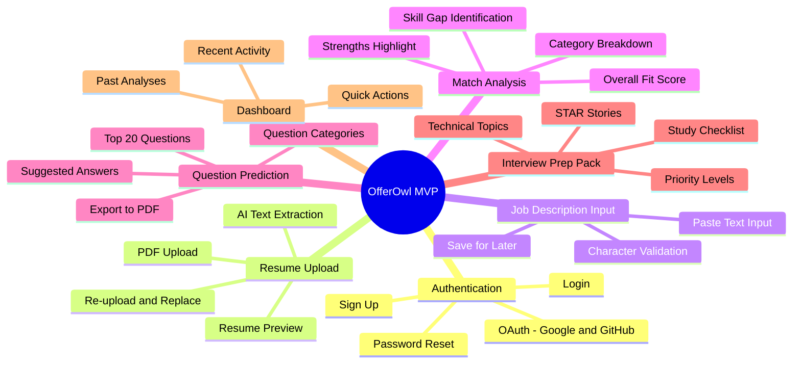
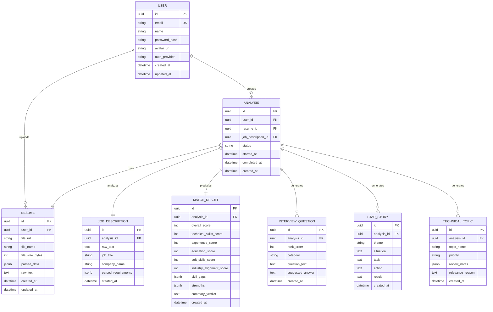
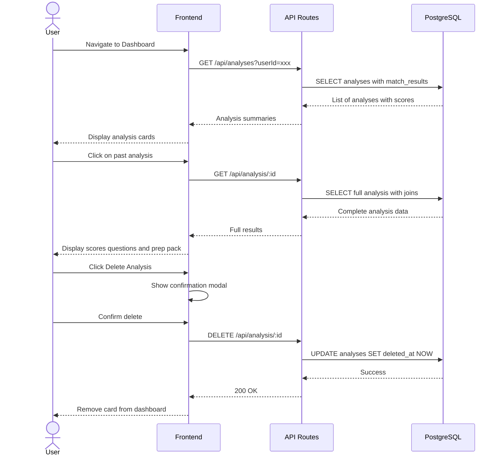
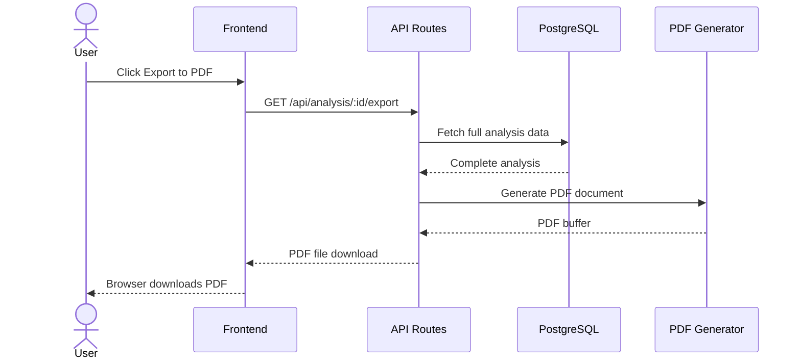
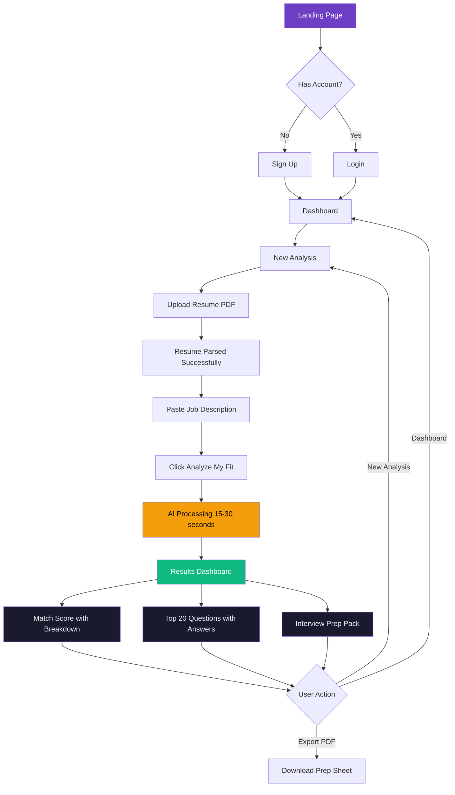

# 🦉 OfferOwl — Product Requirements Document (PRD)

**Version:** 1.0 (MVP)  
**Author:** Product Team  
**Date:** June 15, 2026  
**Status:** Draft  

---

## Table of Contents

1. [Product Overview](#1-product-overview)
2. [Tech Stack](#2-tech-stack)
3. [Features & Requirements](#3-features--requirements)
4. [Data Model](#4-data-model)
5. [Database Sequence Diagram](#5-database-sequence-diagram)
6. [UX & Design Guidelines](#6-ux--design-guidelines)
7. [Core User Flow](#7-core-user-flow)
8. [Edge Cases & Error Handling](#8-edge-cases--error-handling)
9. [Success Metrics](#9-success-metrics)
10. [Open Questions & Future Considerations](#10-open-questions--future-considerations)

---

## 1. Product Overview

### 1.1 Vision Statement

> **OfferOwl** is an AI-powered interview preparation SaaS that transforms the night-before-interview panic into structured, personalized confidence. Upload your resume, paste the job description, and let AI do the heavy lifting — so you walk into every interview prepared, not panicked.

### 1.2 Problem Statement

Job candidates — especially the night before an interview — face five recurring anxieties:

| Anxiety | What the candidate thinks |
|---|---|
| **Question Uncertainty** | *"What questions will they ask me?"* |
| **Qualification Doubt** | *"Am I even qualified enough for this role?"* |
| **Response Paralysis** | *"What should I say when they ask about X?"* |
| **Study Overload** | *"What should I study tonight? I can't review everything."* |
| **Behavioral Dread** | *"How do I avoid failing behavioral questions? I never have good stories."* |

Existing solutions are either too generic (Google "common interview questions"), too expensive (interview coaches at $200+/hr), or too time-consuming (multi-week bootcamp prep courses). None of them are personalized to **both** the candidate's background **and** the specific role they're applying for.

### 1.3 Solution

OfferOwl solves this by:

1. **Ingesting** the candidate's resume (PDF) and the target job description (pasted text).
2. **Analyzing** the match between the candidate and the role, producing a quantitative fit score with granular breakdowns.
3. **Predicting** the top 20 most likely interview questions with suggested answers tailored to the candidate's experience.
4. **Generating** a personalized Interview Prep Pack containing STAR stories and prioritized technical topics to review.

### 1.4 Target Users

| Persona | Description |
|---|---|
| **The Anxious Applicant** | Has an interview in 24-48 hours, wants fast, actionable prep |
| **The Career Switcher** | Changing industries, unsure how to position transferable skills |
| **The New Grad** | Limited experience, struggles to craft compelling behavioral answers |
| **The Passive Job Seeker** | Casually exploring, wants a quick "am I a fit?" assessment before investing time |

### 1.5 Scope — MVP V1

**In Scope:**
- User authentication (sign-up / login)
- Resume upload (PDF only)
- Job description input (paste text)
- AI-powered match analysis with scoring
- Top 20 predicted interview questions with suggested answers
- Interview Prep Pack (STAR stories + prioritized technical topics)
- Dashboard to view past analyses
- Responsive web application

**Out of Scope (V1):**
- Mock interview simulations (audio/video)
- Resume builder / editor
- Job board integrations
- Team / enterprise accounts
- Mobile native apps
- Multi-language support

---

## 2. Tech Stack

### 2.1 Architecture Overview

OfferOwl follows a **monolithic-first** architecture using Next.js for both frontend and backend, optimized for speed of development and iteration during the MVP phase.

```
┌──────────────────────────────────────────────────┐
│                    CLIENT                         │
│          Next.js (React + TypeScript)             │
│          Styled with Tailwind CSS v4              │
└──────────────┬───────────────────────────────────┘
               │ HTTPS
┌──────────────▼───────────────────────────────────┐
│               SERVER (Next.js API Routes)         │
│  ┌─────────┐  ┌──────────┐  ┌─────────────────┐  │
│  │  Auth   │  │  Resume  │  │   AI Analysis   │  │
│  │(NextAuth│  │  Parser  │  │  (OpenAI API)   │  │
│  │  .js)   │  │ (pdf-parse│  │                 │  │
│  └─────────┘  └──────────┘  └─────────────────┘  │
└──────────────┬───────────────────────────────────┘
               │
    ┌──────────┴──────────┐
    │                     │
┌───▼────┐         ┌──────▼──────┐
│PostgreSQL│        │  Supabase   │
│(Prisma) │        │  Storage    │
│         │        │  (PDF files)│
└─────────┘        └─────────────┘
```

### 2.2 Technology Choices

| Layer | Technology | Rationale |
|---|---|---|
| **Framework** | Next.js 15 (App Router) | Full-stack React framework; SSR + API routes in one codebase |
| **Language** | TypeScript | Type safety, better DX, fewer runtime errors |
| **Styling** | Tailwind CSS v4 + shadcn/ui | Rapid UI development, consistent design system, accessible components |
| **Database** | PostgreSQL (via Supabase) | Relational data model, JSONB for flexible AI output storage, scalable |
| **ORM** | Prisma | Type-safe database queries, auto-generated types, easy migrations |
| **Authentication** | NextAuth.js (Auth.js v5) | Flexible auth with OAuth (Google, GitHub) + email/password |
| **AI / LLM** | OpenAI GPT-4o API | Best-in-class reasoning for resume analysis, question generation |
| **PDF Parsing** | `pdf-parse` + `pdf2json` | Extract structured text from uploaded resume PDFs |
| **File Storage** | Supabase Storage | Managed file storage for resume PDFs with row-level security |
| **Deployment** | Vercel | Optimized for Next.js, automatic previews, edge network |
| **Monitoring** | Vercel Analytics + Sentry | Performance monitoring, error tracking |
| **Rate Limiting** | Upstash Redis | Serverless-friendly rate limiting for AI API calls |

### 2.3 AI Model Strategy

| Task | Model | Max Tokens | Temperature |
|---|---|---|---|
| Resume Parsing & Structuring | GPT-4o | 4,096 | 0.1 |
| Match Analysis & Scoring | GPT-4o | 4,096 | 0.2 |
| Question Generation | GPT-4o | 8,192 | 0.5 |
| STAR Story Generation | GPT-4o | 8,192 | 0.6 |
| Technical Topics Prioritization | GPT-4o | 4,096 | 0.3 |

> **Note:** Temperature settings are calibrated: lower values (0.1–0.3) for factual/analytical tasks, higher values (0.5–0.6) for creative generation tasks. These should be A/B tested post-launch.

---

## 3. Features & Requirements

### 3.1 Feature Map



### 3.2 Feature Details

#### F1: User Authentication

| ID | Requirement | Priority | Acceptance Criteria |
|---|---|---|---|
| F1.1 | User can sign up with email + password | P0 | Account created, verification email sent, user redirected to dashboard |
| F1.2 | User can log in with email + password | P0 | Valid credentials grant access; invalid show error |
| F1.3 | User can sign up / log in via Google OAuth | P0 | One-click Google auth, auto-create account if new |
| F1.4 | User can sign up / log in via GitHub OAuth | P1 | One-click GitHub auth, auto-create account if new |
| F1.5 | User can reset password via email | P1 | Reset link sent, expires in 1 hour, password updated |
| F1.6 | Session persists across page reloads | P0 | JWT/session cookie maintains auth state |

#### F2: Resume Upload

| ID | Requirement | Priority | Acceptance Criteria |
|---|---|---|---|
| F2.1 | User can upload a PDF resume (max 5MB) | P0 | File accepted, stored in Supabase Storage, preview shown |
| F2.2 | System extracts text from PDF using AI | P0 | Structured data extracted: name, experience, skills, education |
| F2.3 | User can preview extracted resume data | P1 | Parsed sections displayed for user verification |
| F2.4 | User can re-upload to replace existing resume | P0 | Old file deleted, new file processed, analysis reset |
| F2.5 | Non-PDF files are rejected with clear error | P0 | Error message: "Please upload a PDF file" |
| F2.6 | Files exceeding 5MB are rejected | P0 | Error message: "File too large. Max size is 5MB" |

#### F3: Job Description Input

| ID | Requirement | Priority | Acceptance Criteria |
|---|---|---|---|
| F3.1 | User can paste job description text | P0 | Text input accepts 100–10,000 characters |
| F3.2 | Character count displayed in real-time | P1 | Counter updates as user types/pastes |
| F3.3 | User can edit job description before analysis | P0 | Text is editable until "Analyze" is clicked |
| F3.4 | Empty or too-short input is rejected | P0 | Error if < 100 characters: "Please provide a more detailed job description" |

#### F4: AI Match Analysis

| ID | Requirement | Priority | Acceptance Criteria |
|---|---|---|---|
| F4.1 | System generates an **Overall Fit Score** (0–100) | P0 | Score displayed prominently with visual indicator (gauge/ring) |
| F4.2 | System provides **Category Breakdown** scores | P0 | Individual scores for: Technical Skills, Experience Level, Education, Soft Skills, Industry Alignment |
| F4.3 | System identifies **Skill Gaps** | P0 | List of required skills the candidate is missing, with severity |
| F4.4 | System highlights **Strengths** | P0 | List of areas where candidate exceeds requirements |
| F4.5 | System provides a **Summary Verdict** | P0 | 2–3 sentence natural language summary of fit |
| F4.6 | Analysis completes within 30 seconds | P0 | Loading state shown; timeout at 60s with retry option |

**Scoring Rubric:**

| Score Range | Label | Color | Description |
|---|---|---|---|
| 85–100 | Excellent Match | 🟢 Green | Strong alignment across most categories |
| 70–84 | Good Match | 🟡 Yellow-Green | Solid fit with minor gaps |
| 50–69 | Moderate Match | 🟠 Orange | Notable gaps but transferable skills present |
| 30–49 | Weak Match | 🔴 Red-Orange | Significant gaps; consider upskilling |
| 0–29 | Low Match | 🔴 Red | Major misalignment; role may not be a fit |

#### F5: Top 20 Interview Questions & Suggested Answers

| ID | Requirement | Priority | Acceptance Criteria |
|---|---|---|---|
| F5.1 | System generates 20 predicted interview questions | P0 | Questions categorized by type (behavioral, technical, situational, role-specific) |
| F5.2 | Each question has a suggested answer | P0 | Answers are personalized using candidate's resume data |
| F5.3 | Questions are ranked by likelihood | P1 | Ordered from most to least likely to be asked |
| F5.4 | User can expand/collapse individual Q&A pairs | P0 | Accordion-style UI for easy scanning |
| F5.5 | User can export questions to PDF | P2 | "Download PDF" generates a printable prep sheet |
| F5.6 | Questions span at least 3 categories | P0 | Mix of behavioral, technical, and situational |

**Question Category Distribution:**

| Category | Count | Examples |
|---|---|---|
| Behavioral | 5–7 | "Tell me about a time you handled conflict..." |
| Technical | 5–7 | "Explain how you would design a system for..." |
| Situational | 3–5 | "What would you do if your project deadline was moved up?" |
| Role-Specific | 3–5 | "Why are you interested in this specific position?" |

#### F6: Interview Prep Pack

| ID | Requirement | Priority | Acceptance Criteria |
|---|---|---|---|
| F6.1 | System generates 3–5 **STAR stories** | P0 | Each story follows the STAR format (Situation, Task, Action, Result) |
| F6.2 | STAR stories map to common behavioral themes | P0 | Themes: Leadership, Conflict, Failure, Achievement, Teamwork |
| F6.3 | STAR stories are derived from the candidate's resume | P0 | Stories reference actual experiences from the resume |
| F6.4 | System generates **Technical Topics to Review** | P0 | Topics listed with priority: High, Medium, Low |
| F6.5 | Technical topics include brief review notes | P1 | 2–3 bullet points per topic with key concepts to review |
| F6.6 | Priority is based on job description emphasis | P0 | Topics mentioned more in JD = higher priority |
| F6.7 | Prep pack can be exported as PDF | P2 | Single downloadable document with all prep materials |

**STAR Story Schema:**

```
┌─────────────────────────────────────────┐
│ STAR Story: [Theme - e.g., Leadership]  │
├─────────────────────────────────────────┤
│ 🔹 Situation                            │
│   Context from your experience at [Co.] │
│                                         │
│ 🔹 Task                                 │
│   What you were responsible for         │
│                                         │
│ 🔹 Action                               │
│   Specific steps you took               │
│                                         │
│ 🔹 Result                               │
│   Quantifiable outcome / impact         │
└─────────────────────────────────────────┘
```

**Technical Topic Priority Schema:**

| Priority | Criteria | Action |
|---|---|---|
| 🔴 **High** | Explicitly required in JD + candidate has gaps | Must review tonight |
| 🟡 **Medium** | Mentioned in JD + candidate has some experience | Review if time permits |
| 🟢 **Low** | Implicitly related to role + candidate is proficient | Quick refresh only |

#### F7: Dashboard

| ID | Requirement | Priority | Acceptance Criteria |
|---|---|---|---|
| F7.1 | User sees a list of past analyses | P0 | Each entry shows: job title, company, score, date |
| F7.2 | User can click into any past analysis | P0 | Full analysis results displayed |
| F7.3 | User can delete a past analysis | P1 | Confirmation modal, then soft-delete |
| F7.4 | User can start a new analysis from dashboard | P0 | "New Analysis" CTA prominently displayed |
| F7.5 | Dashboard shows quick stats | P2 | Total analyses, average score, most recent |

---

## 4. Data Model

### 4.1 Entity Relationship Diagram



### 4.2 Schema Details

#### `users` Table

| Column | Type | Constraints | Description |
|---|---|---|---|
| `id` | UUID | PK, DEFAULT uuid_generate_v4() | Unique identifier |
| `email` | VARCHAR(255) | UNIQUE, NOT NULL | User email address |
| `name` | VARCHAR(255) | NOT NULL | Display name |
| `password_hash` | VARCHAR(255) | NULLABLE | Hashed password (null for OAuth users) |
| `avatar_url` | TEXT | NULLABLE | Profile picture URL |
| `auth_provider` | VARCHAR(50) | NOT NULL, DEFAULT 'email' | Auth method: 'email', 'google', 'github' |
| `created_at` | TIMESTAMP | NOT NULL, DEFAULT NOW() | Account creation time |
| `updated_at` | TIMESTAMP | NOT NULL, DEFAULT NOW() | Last profile update |

#### `resumes` Table

| Column | Type | Constraints | Description |
|---|---|---|---|
| `id` | UUID | PK | Unique identifier |
| `user_id` | UUID | FK → users.id, NOT NULL | Owning user |
| `file_url` | TEXT | NOT NULL | Storage URL for the PDF |
| `file_name` | VARCHAR(255) | NOT NULL | Original file name |
| `file_size_bytes` | INTEGER | NOT NULL | File size for validation |
| `parsed_data` | JSONB | NULLABLE | Structured extraction (skills, experience, education) |
| `raw_text` | TEXT | NULLABLE | Full extracted text from PDF |
| `created_at` | TIMESTAMP | NOT NULL, DEFAULT NOW() | Upload time |
| `updated_at` | TIMESTAMP | NOT NULL, DEFAULT NOW() | Last re-parse time |

**`parsed_data` JSONB Structure:**

```json
{
  "name": "Jane Doe",
  "contact": {
    "email": "jane@example.com",
    "phone": "+1-555-0123",
    "linkedin": "linkedin.com/in/janedoe"
  },
  "summary": "Senior software engineer with 6 years...",
  "experience": [
    {
      "title": "Senior Software Engineer",
      "company": "TechCorp",
      "start_date": "2021-03",
      "end_date": "present",
      "description": "Led a team of 5...",
      "achievements": [
        "Reduced API latency by 40%",
        "Mentored 3 junior developers"
      ]
    }
  ],
  "education": [
    {
      "degree": "B.S. Computer Science",
      "institution": "State University",
      "year": 2018
    }
  ],
  "skills": ["TypeScript", "React", "Node.js", "PostgreSQL", "AWS"],
  "certifications": ["AWS Solutions Architect"],
  "languages": ["English", "Spanish"]
}
```

#### `analyses` Table

| Column | Type | Constraints | Description |
|---|---|---|---|
| `id` | UUID | PK | Unique identifier |
| `user_id` | UUID | FK → users.id, NOT NULL | Owning user |
| `resume_id` | UUID | FK → resumes.id, NOT NULL | Resume used |
| `job_description_id` | UUID | FK → job_descriptions.id | Associated JD |
| `status` | VARCHAR(20) | NOT NULL, DEFAULT 'pending' | Status: pending, processing, completed, failed |
| `started_at` | TIMESTAMP | NULLABLE | Processing start time |
| `completed_at` | TIMESTAMP | NULLABLE | Processing completion time |
| `created_at` | TIMESTAMP | NOT NULL, DEFAULT NOW() | Record creation time |

#### `job_descriptions` Table

| Column | Type | Constraints | Description |
|---|---|---|---|
| `id` | UUID | PK | Unique identifier |
| `analysis_id` | UUID | FK → analyses.id, NOT NULL | Parent analysis |
| `raw_text` | TEXT | NOT NULL | Original pasted text |
| `job_title` | VARCHAR(255) | NULLABLE | Extracted job title |
| `company_name` | VARCHAR(255) | NULLABLE | Extracted company name |
| `parsed_requirements` | JSONB | NULLABLE | Structured extraction of requirements |
| `created_at` | TIMESTAMP | NOT NULL, DEFAULT NOW() | Creation time |

#### `match_results` Table

| Column | Type | Constraints | Description |
|---|---|---|---|
| `id` | UUID | PK | Unique identifier |
| `analysis_id` | UUID | FK → analyses.id, UNIQUE, NOT NULL | Parent analysis (1:1) |
| `overall_score` | INTEGER | NOT NULL, CHECK (0–100) | Composite fit score |
| `technical_skills_score` | INTEGER | NOT NULL, CHECK (0–100) | Technical alignment |
| `experience_score` | INTEGER | NOT NULL, CHECK (0–100) | Experience level match |
| `education_score` | INTEGER | NOT NULL, CHECK (0–100) | Education requirements match |
| `soft_skills_score` | INTEGER | NOT NULL, CHECK (0–100) | Soft skill alignment |
| `industry_alignment_score` | INTEGER | NOT NULL, CHECK (0–100) | Industry/domain fit |
| `skill_gaps` | JSONB | NOT NULL | Missing skills with severity |
| `strengths` | JSONB | NOT NULL | Exceeding areas |
| `summary_verdict` | TEXT | NOT NULL | Natural language summary |
| `created_at` | TIMESTAMP | NOT NULL, DEFAULT NOW() | Creation time |

#### `interview_questions` Table

| Column | Type | Constraints | Description |
|---|---|---|---|
| `id` | UUID | PK | Unique identifier |
| `analysis_id` | UUID | FK → analyses.id, NOT NULL | Parent analysis |
| `rank_order` | INTEGER | NOT NULL, CHECK (1–20) | Likelihood ranking |
| `category` | VARCHAR(50) | NOT NULL | behavioral, technical, situational, role_specific |
| `question_text` | TEXT | NOT NULL | The predicted question |
| `suggested_answer` | TEXT | NOT NULL | Personalized suggested answer |
| `created_at` | TIMESTAMP | NOT NULL, DEFAULT NOW() | Creation time |

#### `star_stories` Table

| Column | Type | Constraints | Description |
|---|---|---|---|
| `id` | UUID | PK | Unique identifier |
| `analysis_id` | UUID | FK → analyses.id, NOT NULL | Parent analysis |
| `theme` | VARCHAR(50) | NOT NULL | leadership, conflict, failure, achievement, teamwork |
| `situation` | TEXT | NOT NULL | STAR — Situation |
| `task` | TEXT | NOT NULL | STAR — Task |
| `action` | TEXT | NOT NULL | STAR — Action |
| `result` | TEXT | NOT NULL | STAR — Result |
| `created_at` | TIMESTAMP | NOT NULL, DEFAULT NOW() | Creation time |

#### `technical_topics` Table

| Column | Type | Constraints | Description |
|---|---|---|---|
| `id` | UUID | PK | Unique identifier |
| `analysis_id` | UUID | FK → analyses.id, NOT NULL | Parent analysis |
| `topic_name` | VARCHAR(255) | NOT NULL | Topic name |
| `priority` | VARCHAR(10) | NOT NULL | high, medium, low |
| `review_notes` | JSONB | NOT NULL | Array of bullet points |
| `relevance_reason` | TEXT | NOT NULL | Why this topic is relevant |
| `created_at` | TIMESTAMP | NOT NULL, DEFAULT NOW() | Creation time |

---

## 5. Database Sequence Diagram

### 5.1 Core Analysis Flow

```mermaid
sequenceDiagram
    actor User
    participant UI as Frontend (Next.js)
    participant API as API Routes
    participant Auth as NextAuth.js
    participant Storage as Supabase Storage
    participant DB as PostgreSQL
    participant AI as OpenAI GPT-4o
    participant Parser as PDF Parser

    Note over User, Parser: Authentication Flow
    User->>UI: Click Sign Up or Login
    UI->>Auth: Authenticate via email or OAuth
    Auth->>DB: Create or verify user record
    DB-->>Auth: User data
    Auth-->>UI: Session token
    UI-->>User: Redirect to Dashboard

    Note over User, Parser: Resume Upload Flow
    User->>UI: Upload resume PDF
    UI->>API: POST /api/resume/upload
    API->>API: Validate file type and size
    API->>Storage: Store PDF file
    Storage-->>API: File URL
    API->>Parser: Extract text from PDF
    Parser-->>API: Raw text content
    API->>AI: Structure resume data
    AI-->>API: Structured JSON
    API->>DB: INSERT INTO resumes
    DB-->>API: Resume record
    API-->>UI: Resume parsed successfully
    UI-->>User: Show parsed resume preview

    Note over User, Parser: Analysis Flow
    User->>UI: Paste job description and click Analyze
    UI->>API: POST /api/analysis/create
    API->>DB: INSERT INTO analyses status pending
    API->>DB: INSERT INTO job_descriptions
    DB-->>API: Analysis ID

    rect rgb(40, 40, 80)
        Note over API, AI: AI Processing Pipeline - async
        API->>AI: Step 1 Parse job description
        AI-->>API: Structured JD requirements
        API->>DB: UPDATE job_descriptions parsed_requirements

        API->>AI: Step 2 Match analysis resume vs JD
        AI-->>API: Scores gaps strengths verdict
        API->>DB: INSERT INTO match_results

        API->>AI: Step 3 Generate interview questions
        AI-->>API: 20 ranked questions with answers
        API->>DB: INSERT INTO interview_questions x20

        API->>AI: Step 4 Generate STAR stories
        AI-->>API: 3 to 5 STAR stories by theme
        API->>DB: INSERT INTO star_stories x3 to 5

        API->>AI: Step 5 Generate technical topics
        AI-->>API: Prioritized technical topics
        API->>DB: INSERT INTO technical_topics
    end

    API->>DB: UPDATE analyses SET status completed
    API-->>UI: Analysis complete via SSE or polling
    UI-->>User: Display full results dashboard
```



### 5.2 Dashboard and History Flow



### 5.3 PDF Export Flow



---

## 6. UX & Design Guidelines

### 6.1 Design Principles

| Principle | Description |
|---|---|
| **Calming Confidence** | The UI should reduce anxiety, not increase it. Use soothing colors, clear progress indicators, and encouraging copy. |
| **Speed First** | Users have interviews tomorrow. Every interaction should feel fast and frictionless. |
| **Scannable Results** | Results should be digestible at a glance with the option to drill deeper. |
| **Print-Friendly** | Key outputs (questions, prep pack) should be exportable and printable. |
| **Encouraging Tone** | Copy should be supportive, never discouraging — even for low match scores. |

### 6.2 Brand Identity

| Element | Specification |
|---|---|
| **App Name** | OfferOwl |
| **Tagline** | *"Walk in prepared, walk out with an offer."* |
| **Logo Concept** | A friendly, wise owl icon wearing a graduation cap or holding a briefcase. Approachable, not corporate. |
| **Mascot** | "Ollie" — the OfferOwl mascot. Appears in empty states, loading screens, and success moments. |

### 6.3 Color Palette

| Token | Hex | Usage |
|---|---|---|
| **Primary** | `#6C3FC5` | Buttons, links, active states (rich purple — wisdom, confidence) |
| **Primary Light** | `#8B6BD4` | Hover states, secondary elements |
| **Primary Dark** | `#4E2A9A` | Pressed states, headings |
| **Secondary** | `#F59E0B` | Accents, highlights, owl-themed elements (amber/gold) |
| **Background** | `#0F0F1A` | Main dark background |
| **Surface** | `#1A1A2E` | Cards, panels |
| **Surface Elevated** | `#252540` | Modals, dropdowns |
| **Text Primary** | `#F1F1F6` | Main body text |
| **Text Secondary** | `#9CA3AF` | Muted text, labels |
| **Success** | `#10B981` | High scores, strengths |
| **Warning** | `#F59E0B` | Medium priority, caution |
| **Error** | `#EF4444` | Errors, low scores, gaps |
| **Info** | `#3B82F6` | Informational elements |

### 6.4 Typography

| Element | Font | Weight | Size |
|---|---|---|---|
| **Headings (H1–H3)** | Inter | 700 (Bold) | 32px / 24px / 20px |
| **Body** | Inter | 400 (Regular) | 16px |
| **Small / Caption** | Inter | 400 | 14px |
| **Monospace (code)** | JetBrains Mono | 400 | 14px |
| **Score Display** | Inter | 800 (Extra Bold) | 48px |

### 6.5 Component Guidelines

**Cards:**
- Rounded corners: `12px`
- Background: `Surface` color with subtle border (`1px solid rgba(255,255,255,0.06)`)
- Box shadow: subtle glassmorphism effect
- Padding: `24px`

**Buttons:**
- Primary: Filled with `Primary` color, white text
- Secondary: Outlined with `Primary` border
- Rounded corners: `8px`
- Height: `44px` (touch-friendly)
- Hover: subtle lift + brightness increase

**Score Gauges:**
- Circular progress ring for overall score
- Horizontal bar charts for category breakdowns
- Animated fill on page load (0 → actual score)
- Color-coded based on scoring rubric

**Loading States:**
- Skeleton screens (not spinners) for content areas
- Animated owl mascot for AI processing wait states
- Step-by-step progress indicator: "Analyzing resume → Scoring match → Generating questions → Building prep pack"

### 6.6 Responsive Breakpoints

| Breakpoint | Width | Layout |
|---|---|---|
| **Mobile** | < 640px | Single column, stacked cards |
| **Tablet** | 640px – 1024px | Two-column where appropriate |
| **Desktop** | > 1024px | Full layout with sidebar navigation |

### 6.7 Page Map

| Page | Route | Description |
|---|---|---|
| Landing / Marketing | `/` | Hero, features, CTA to sign up |
| Login | `/login` | Email/password + OAuth buttons |
| Sign Up | `/signup` | Registration form |
| Dashboard | `/dashboard` | List of past analyses + new analysis CTA |
| New Analysis | `/analysis/new` | Upload resume + paste JD + analyze |
| Analysis Results | `/analysis/[id]` | Full results: score, questions, prep pack |
| Settings | `/settings` | Account settings, profile |

---

## 7. Core User Flow

### 7.1 Primary Happy Path



### 7.2 Step-by-Step Walkthrough

| Step | Screen | User Action | System Response |
|---|---|---|---|
| 1 | Landing | Clicks "Get Started Free" | Redirect to sign-up |
| 2 | Sign Up | Enters email + password OR clicks "Continue with Google" | Account created, redirect to dashboard |
| 3 | Dashboard | Sees empty state with owl mascot. Clicks "Start Your First Analysis" | Navigate to new analysis page |
| 4 | New Analysis | Drags or clicks to upload resume PDF | File uploaded, parsing begins. Skeleton loading shown. Parsed data preview appears. |
| 5 | New Analysis | Pastes job description into text area | Character count updates. Job title auto-detected if possible. |
| 6 | New Analysis | Clicks "Analyze My Fit" button | Button transitions to loading. Progress stepper shown: Step 1/5, 2/5... |
| 7 | Processing | Waits 15–30 seconds | Owl mascot animation + progress steps. Estimated time remaining shown. |
| 8 | Results | Views Match Score tab | Animated score ring fills to value. Breakdown bars animate. Strengths/gaps listed. |
| 9 | Results | Switches to Questions tab | 20 questions displayed in accordion. Categories tagged with colored badges. |
| 10 | Results | Expands a question | Suggested answer slides open. "Copy" button available. |
| 11 | Results | Switches to Prep Pack tab | STAR stories in cards. Technical topics in priority-sorted list. |
| 12 | Results | Clicks "Export Full Prep Pack" | PDF downloads with all analysis results formatted for printing. |

---

## 8. Edge Cases & Error Handling

### 8.1 Input Validation Errors

| Scenario | Detection | User Message | Recovery |
|---|---|---|---|
| Non-PDF file uploaded | Client-side MIME check + server validation | "Oops! OfferOwl only accepts PDF resumes. Please upload a .pdf file." | Show upload area again |
| PDF exceeds 5MB | Client-side size check + server validation | "This file is too large (max 5MB). Try compressing your PDF or removing images." | Show upload area again |
| Corrupt / unreadable PDF | Server-side: pdf-parse throws error | "We couldn't read this PDF. It might be corrupted or image-only. Try re-exporting from your editor." | Show upload area with re-upload option |
| Image-only PDF (scanned) | AI extraction returns near-empty text | "This looks like a scanned document. For best results, please upload a text-based PDF." | Suggest re-saving resume from Word/Docs |
| Job description too short (< 100 chars) | Client-side character count | "Please provide a more detailed job description (at least 100 characters) for accurate analysis." | Keep text area active, highlight counter |
| Job description too long (> 10,000 chars) | Client-side character count | "Job description is too long. Please trim to under 10,000 characters." | Prevent paste beyond limit |
| Empty job description submitted | Client-side validation | "Please paste a job description before analyzing." | Focus text area |

### 8.2 AI / Processing Errors

| Scenario | Detection | User Message | Recovery |
|---|---|---|---|
| OpenAI API timeout (> 60s) | Server-side timeout handler | "Our AI is taking longer than usual. This might be due to high demand." | "Retry" button; auto-retry once |
| OpenAI API rate limited (429) | HTTP status code | "We're experiencing high demand. Please try again in a moment." | Auto-retry with exponential backoff (3 attempts) |
| OpenAI API error (500) | HTTP status code | "Something went wrong on our end. We've been notified and are looking into it." | Log to Sentry; show "Retry" button |
| AI returns malformed JSON | JSON parse error | "We had trouble processing your results. Retrying..." | Auto-retry with stricter prompt; fallback to raw text display |
| Partial analysis failure | One AI step fails | Save successful steps, mark analysis as "partial" | Show completed sections; "Retry failed sections" button |
| AI generates inappropriate content | Output content filter | Filter and regenerate | Re-prompt with stricter guardrails |

### 8.3 Authentication & Session Errors

| Scenario | Detection | User Message | Recovery |
|---|---|---|---|
| Session expired during analysis | 401 response on API call | "Your session has expired. Don't worry — your work is saved." | Redirect to login; restore state after re-auth |
| OAuth provider unavailable | OAuth callback error | "Google/GitHub login is temporarily unavailable. Try email login." | Show email/password form |
| Duplicate email signup | Database unique constraint | "An account with this email already exists. Try logging in instead." | Link to login page |
| Invalid login credentials | Auth check failure | "Incorrect email or password. Please try again." | Show "Forgot password?" link |

### 8.4 Data & Storage Errors

| Scenario | Detection | User Message | Recovery |
|---|---|---|---|
| File storage upload fails | Supabase Storage error | "We couldn't save your resume. Please try uploading again." | Retry upload |
| Database write fails | Prisma error | "Something went wrong saving your results. Please try again." | Retry operation; log to Sentry |
| Analysis not found (404) | Database query returns null | "This analysis doesn't exist or has been deleted." | Redirect to dashboard |
| Concurrent analysis limit exceeded | Count check (max 3 concurrent) | "You have too many analyses in progress. Please wait for one to complete." | Show processing analyses with status |

### 8.5 Network & Client Errors

| Scenario | Detection | User Message | Recovery |
|---|---|---|---|
| User loses internet during analysis | Navigator.onLine + fetch error | "You seem to be offline. Your analysis will continue on our servers." | Auto-reconnect and poll for results |
| User closes tab during analysis | N/A (server-side processing) | N/A | Analysis continues server-side; results available on return |
| Browser doesn't support file upload | Feature detection | "Your browser doesn't support file uploads. Please use a modern browser." | List supported browsers |

---

## 9. Success Metrics

### 9.1 North Star Metric

> **Prep Packs Generated Per Week** — The number of complete analyses (score + questions + prep pack) generated per week. This directly measures the core value delivery.

### 9.2 Key Performance Indicators (KPIs)

#### Acquisition Metrics

| Metric | Target (Month 1) | Target (Month 3) | Measurement |
|---|---|---|---|
| **New Sign-ups** | 500 | 2,000 | Auth provider records |
| **Landing → Sign-up Conversion** | 15% | 25% | Analytics funnel |
| **Sign-up → First Analysis Conversion** | 60% | 75% | Database events |

#### Engagement Metrics

| Metric | Target (Month 1) | Target (Month 3) | Measurement |
|---|---|---|---|
| **Analyses per User (weekly)** | 1.5 | 2.0 | Database aggregation |
| **Prep Pack Completion Rate** | 70% | 85% | User reaches all 3 result tabs |
| **PDF Export Rate** | 20% | 35% | Export API call count |
| **Return Rate (7-day)** | 30% | 45% | User revisits within 7 days |
| **Average Session Duration** | 8 min | 12 min | Analytics |

#### Quality Metrics

| Metric | Target | Measurement |
|---|---|---|
| **Analysis Completion Rate** | > 95% | Successful / total analyses |
| **Average Analysis Time** | < 30s | Time from "Analyze" click to results |
| **AI Error Rate** | < 2% | Failed AI calls / total calls |
| **User-Reported Accuracy** | > 4.0/5.0 | In-app feedback widget |

#### Business Metrics

| Metric | Target (Month 3) | Target (Month 6) | Measurement |
|---|---|---|---|
| **Monthly Active Users (MAU)** | 1,000 | 5,000 | Unique users per month |
| **Free → Paid Conversion** | 5% | 10% | Stripe subscription events |
| **Monthly Recurring Revenue (MRR)** | $500 | $5,000 | Stripe dashboard |
| **Customer Acquisition Cost (CAC)** | < $10 | < $8 | Ad spend / new users |
| **Net Promoter Score (NPS)** | > 40 | > 50 | In-app survey |

### 9.3 Guardrail Metrics

> **Warning:** These metrics should NOT degrade as we optimize for growth. If they breach thresholds, pause feature development and investigate.

| Guardrail | Threshold | Alert |
|---|---|---|
| **P95 Page Load Time** | < 3 seconds | Slack + PagerDuty |
| **API Error Rate** | < 1% | Sentry alert |
| **AI Hallucination Reports** | < 5/week | Manual review queue |
| **Unsubscribe / Churn Rate** | < 8% monthly | Weekly review |

---

## 10. Open Questions & Future Considerations

### 10.1 Open Questions for V1

| # | Question | Options | Decision Owner | Status |
|---|---|---|---|---|
| OQ-1 | **Pricing model for MVP?** | (a) Freemium: 3 free analyses/month, then $9.99/mo unlimited (b) Fully free during beta (c) Pay-per-analysis at $2.99 | Product + Business | Open |
| OQ-2 | **Should we support DOCX resume upload in V1?** | (a) PDF only for V1 (b) PDF + DOCX from day one | Engineering | Decided: PDF only |
| OQ-3 | **How to handle resumes with very little content?** (e.g., new grads with 1 job) | (a) Lower quality results with disclaimer (b) Prompt user to add more info (c) Supplementary questionnaire | Product + Design | Open |
| OQ-4 | **Should match scores be calibrated against real outcomes?** | (a) Not in V1, use heuristic scoring (b) Build feedback loop from day one | Data Science | Open |
| OQ-5 | **Rate limiting strategy for AI calls?** | (a) 5 analyses/day free tier (b) 10 analyses/day free tier (c) Unlimited during beta | Product + Eng | Open |
| OQ-6 | **Should we store resume data or delete after analysis?** | (a) Store for re-use (b) Delete after 30 days (c) User controls retention | Legal + Product | Open |
| OQ-7 | **Multi-language support in V1?** | (a) English only (b) English + Spanish | Product | Decided: English only |

### 10.2 Future Considerations (V2+)

#### V2 — Enhanced Preparation

| Feature | Description | Estimated Effort |
|---|---|---|
| **Mock Interview Mode** | AI-powered conversational mock interview with voice (WebRTC + Whisper + GPT-4o) | Large (8–12 weeks) |
| **Answer Feedback** | User types/records their answer, AI scores and provides improvement suggestions | Medium (4–6 weeks) |
| **Company Research Pack** | Auto-generated briefing on the company (culture, recent news, Glassdoor reviews) | Medium (4–6 weeks) |
| **Salary Negotiation Guide** | AI-generated salary benchmarks and negotiation talking points | Small (2–3 weeks) |

#### V3 — Platform & Network

| Feature | Description | Estimated Effort |
|---|---|---|
| **Job Board Integration** | Import JD directly from LinkedIn, Indeed, Greenhouse URLs | Medium (4–6 weeks) |
| **Interview Calendar** | Track upcoming interviews, auto-remind to prep | Small (2–3 weeks) |
| **Progress Tracking** | Track improvement across multiple analyses and interviews | Medium (4–6 weeks) |
| **Resume Optimizer** | AI suggests resume improvements to increase match scores | Medium (4–6 weeks) |

#### V4 — Enterprise & Scale

| Feature | Description | Estimated Effort |
|---|---|---|
| **Team / Enterprise Plans** | Career coaches can manage multiple candidates | Large (8–12 weeks) |
| **University Partnerships** | Branded portals for university career centers | Large (8–12 weeks) |
| **API Access** | Third-party integrations for ATS and career platforms | Medium (4–6 weeks) |
| **Analytics Dashboard** | Aggregate insights for career coaches and institutions | Medium (4–6 weeks) |

### 10.3 Technical Debt & Architecture Considerations

| Item | Description | When to Address |
|---|---|---|
| **Microservices Migration** | Split AI processing into separate service for independent scaling | When AI processing > 50% of server load |
| **Background Job Queue** | Replace synchronous AI calls with BullMQ/Redis job queue | When concurrent users > 100 |
| **CDN for Exports** | Cache generated PDFs on CDN for faster re-downloads | When export volume > 1000/day |
| **AI Model Evaluation Pipeline** | Automated scoring of AI output quality | Before V2 launch |
| **Multi-region Deployment** | Deploy to EU region for GDPR compliance + latency | When EU users > 20% of base |

### 10.4 Risks & Mitigations

| Risk | Likelihood | Impact | Mitigation |
|---|---|---|---|
| **OpenAI API cost overrun** | High | Medium | Implement strict rate limiting; cache common patterns; consider fine-tuned smaller models |
| **AI hallucination in answers** | Medium | High | Add disclaimers; implement output validation; user feedback loop |
| **Low initial adoption** | Medium | High | Content marketing (blog, Twitter); university partnerships; Product Hunt launch |
| **Competitor launches similar product** | Medium | Medium | Move fast; build brand loyalty; focus on UX quality over features |
| **GDPR / data privacy concerns** | Low | High | Minimal data retention; clear privacy policy; user-controlled deletion |
| **PDF parsing failures for edge cases** | High | Low | Fallback to raw text; manual entry option in V2 |

---

**Next Steps:**

1. Resolve Open Questions (OQ-1, OQ-3, OQ-4, OQ-5, OQ-6) in upcoming product sync
2. Create high-fidelity wireframes based on UX guidelines
3. Set up project repository with tech stack boilerplate
4. Begin Sprint 1: Authentication + Resume Upload + Dashboard Shell
5. Secure OpenAI API key and establish rate limiting infrastructure

---

*This document is a living artifact and should be updated as decisions are made and requirements evolve. Last updated: June 15, 2026.*
